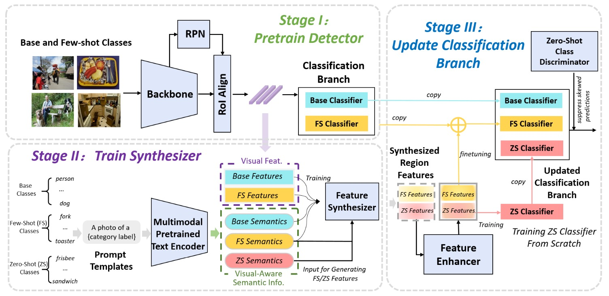

# UniFa: A unified feature hallucination framework for any-shot object detection

Any-shot object detection seeks to simultaneously detect base (many-shot), few-shot and zero-shot categories. We introduce the Unified Feature Hallucination (UniFa) framework, which generates high-quality features for two rare categories. Utilizing CLIP’s text encoder, we transform category names into visual-aware semantic information for generating visual features, facilitating better visual-semantic alignment. A semantically blended feature enhancer is utilized to merge features from any two categories, producing denser and more realistic features. 



## Installation
UniFa is built on [MMFewshot](https://github.com/open-mmlab/mmfewshot/tree/main) and [ZSD-SC-Resolver](https://github.com/sandipan211/ZSD-SC-Resolver). You need to refer to their installation guide to set up the environment.

## Usage
1.train detector
```
sh scripts/detector/tfa_fsd_65_15_base_training.sh
```

2.extract features
```
sh scripts/extract_features/extract_features_65_15.sh
```

3.train generator
```
sh scripts/visual_info_transfer/fsd_65_15_train_coco_generator.sh
```
